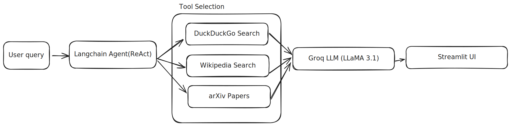

# 🔍 LangChain Search Agent (Streamlit + Groq)

An interactive **AI-powered search chatbot** built with **Streamlit**, **LangChain**, and **Groq LLMs**.
The assistant can answer questions by **reasoning + searching** across:

* 🌐 DuckDuckGo (web search)
* 📄 arXiv (research papers)
* 📚 Wikipedia (encyclopedic knowledge)

It also displays the agent’s **thoughts and tool usage live** using `StreamlitCallbackHandler`.

[Website link](https://search--engine.streamlit.app/)

---

## 🚀 Features

* ✅ Conversational chat UI (Streamlit `st.chat_*`)
* ✅ Agent-based reasoning (`ZERO_SHOT_REACT_DESCRIPTION`)
* ✅ Multi-tool search (Web, arXiv, Wikipedia)
* ✅ Live thought/action streaming
* ✅ Groq-hosted LLaMA models (fast & low latency)
* ✅ No OpenAI dependency

---

## 🧠 Architecture Overview


---

## 🛠️ Tech Stack

| Component       | Used                         |
| --------------- | ---------------------------- |
| UI              | Streamlit                    |
| Agent Framework | LangChain                    |
| LLM Provider    | Groq                         |
| Model           | `llama-3.1-8b-instant`       |
| Search Tools    | DuckDuckGo, Wikipedia, arXiv |
| Language        | Python 3.10                  |

---

## 📦 Installation

### 1️⃣ Clone the repository

```bash
https://github.com/sanjip1203/Search-Engine
cd Search-Engine
```

### 2️⃣ Create and activate virtual environment

```bash
python -m venv venv
source venv/bin/activate   # macOS / Linux
# venv\Scripts\activate    # Windows
```

### 3️⃣ Install dependencies

```bash
pip install -U \
  streamlit \
  langchain \
  langchain-community \
  langchain-classic \
  langchain-groq \
  python-dotenv \
  ddgs
```

---

## 🔑 Groq API Key Setup

You can either:

###  Enter key in the Streamlit sidebar


---

## ▶️ Run the App

⚠️ Always run Streamlit using **your venv Python**:

```bash
python -m streamlit run app.py
```

Open in browser:

```
http://localhost:8501
```

---

## 💬 How It Works

* User enters a query in chat
* LangChain agent decides:

  * “Should I search?”
  * “Which tool should I use?”
* Agent calls tools dynamically
* Final answer is synthesized by the LLM
* All reasoning steps are shown live in the UI

---

## 📂 Project Structure

```
Search-Engine/
│
├── app.py              # Main Streamlit application
├── README.md           # Project documentation
├── .env                # (Optional) API key
├── venv/               # Virtual environment
└── tools and agent.svg # Architecture diagram
```

---


## ⚠️ Notes & Troubleshooting

* Make sure `ddgs` is installed:

  ```bash
  python -c "import ddgs; print('ddgs OK')"
  ```
* Use **supported Groq models only**:
  * `llama-3.1-8b-instant`
* If Streamlit can’t find packages, run:

  ```bash
  python -m streamlit run app.py
  ```


